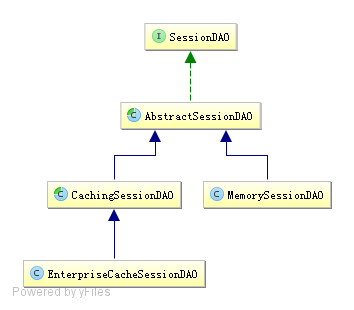

# 会话管理

## 会话
即用户访问应用时保持的连接关系，在多次交互中应用能够识别出当前访问的用户是谁，且可以在多次交互中保存一些数据。如访问一些网站时登录成功后，网站可以记住用户，且在退出之前都可以识别当前用户是谁。

```
login("classpath:shiro.ini", "zhang", "123");  
Subject subject = SecurityUtils.getSubject();  
Session session = subject.getSession(); 
//获取当前会话的唯一标示
session.getId();  
//获取当前subject的主机地址
session.getHost();  
//获取/设置当前Session的过期时间;如果不设置默认是会话的全局过期时间
session.getTimeout();  
session.setTimeout(毫秒);  
//获取会话的启动时间与最后访问时间;如果是JavaSE应用需要定期调用Session.touch()方法更新最后访问时间;如果是web应用,每次进入shiroFilter都会自动调用session.touch()来更新最后访问时间
session.getStartTimestamp();  
session.getLastAccessTime();  
//更新会话最后访问时间 / 销毁会话
session.touch();  
session.stop();   
//设置/获取/删除 会话属性
session.setAttribute("key", "123");  
Assert.assertEquals("123", session.getAttribute("key"));  
session.removeAttribute("key");  
```

可以在sessionManager中设置会话的过期时间 
也可以继承系统默认的filter 比如FormAuthencationFilter, 重写onLoginSuccess() 为subject 的session添加过期时间

## 会话管理器 sessionManager

Shiro提供了三个默认实现：

DefaultSessionManager：DefaultSecurityManager使用的默认实现，用于JavaSE环境；

ServletContainerSessionManager：DefaultWebSecurityManager使用的默认实现，用于Web环境，其直接使用Servlet容器的会话；

DefaultWebSessionManager：用于Web环境的实现，可以替代ServletContainerSessionManager，自己维护着会话，直接废弃了Servlet容器的会话管理。

```
[main]  
sessionManager=org.apache.shiro.session.mgt.DefaultSessionManager  
securityManager.sessionManager=$sessionManager   

WEB中
[main]  
sessionManager=org.apache.shiro.web.session.mgt.ServletContainerSessionManager  
securityManager.sessionManager=$sessionManager  
```

可以设置会话的全局过期时间;默认情况下globalSessionTimeout将应用给所有Session。可以单独设置每个Session的timeout属性来为每个Session设置其超时时间。
```
sessionManager. globalSessionTimeout=1800000   
```

另外如果使用ServletContainerSessionManager进行会话管理，Session的超时依赖于底层Servlet容器的超时时间，可以在web.xml中配置其会话的超时时间（分钟为单位）： 
```
<session-config>  
  <session-timeout>30</session-timeout>  
</session-config>  
```

在Servlet容器中，默认使用JSESSIONID Cookie维护会话，且会话默认是跟容器绑定的；在某些情况下可能需要使用自己的会话机制，此时我们可以使用DefaultWebSessionManager来维护会话：

```
sessionIdCookie=org.apache.shiro.web.servlet.SimpleCookie  
sessionManager=org.apache.shiro.web.session.mgt.DefaultWebSessionManager  
sessionIdCookie.name=sid  
#sessionIdCookie.domain=sishuok.com  
#sessionIdCookie.path=  
sessionIdCookie.maxAge=1800  
sessionIdCookie.httpOnly=true  
sessionManager.sessionIdCookie=$sessionIdCookie  
sessionManager.sessionIdCookieEnabled=true  
securityManager.sessionManager=$sessionManager   
```
sessionIdCookie是sessionManager创建会话Cookie的模板：

sessionIdCookie.name：设置Cookie名字，默认为JSESSIONID；

sessionIdCookie.domain：设置Cookie的域名，默认空，即当前访问的域名；

sessionIdCookie.path：设置Cookie的路径，默认空，即存储在域名根下；

sessionIdCookie.maxAge：设置Cookie的过期时间，秒为单位，默认-1表示关闭浏览器时过期Cookie；

sessionIdCookie.httpOnly：如果设置为true，则客户端不会暴露给客户端脚本代码，使用HttpOnly cookie有助于减少某些类型的跨站点脚本攻击；此特性需要实现了Servlet 2.5 MR6及以上版本的规范的Servlet容器支持；

sessionManager.sessionIdCookieEnabled：是否启用/禁用Session Id Cookie，默认是启用的；如果禁用后将不会设置Session Id Cookie，即默认使用了Servlet容器的JSESSIONID，且通过URL重写（URL中的“;JSESSIONID=id”部分）保存Session Id。

 

另外我们可以如“sessionManager. sessionIdCookie.name=sid”这种方式操作Cookie模板。

## 会话监听器 sessionListener

会话监听器用于监听会话创建、过期及停止事件： 
```
//实现SessionListener接口 需要实现所有接口的方法
public class MySessionListener implements SessionListener {
    @Override
    public void onStart(Session session) {
        System.out.println("会话创建:"+session.getId());
    }
    @Override
    public void onStop(Session session) {
        Collection<Object> attributeKeys = session.getAttributeKeys();
        System.out.println("会话销毁:"+ session.getHost());
        attributeKeys.forEach(n-> System.out.println(n));
    }
    @Override
    public void onExpiration(Session session) {
        System.out.println("会话过期:"+session.getLastAccessTime());
    }
}
继承SessionListenerAdapter 并复写需要定制化的方法
public class MySessionListenerByExtend extends SessionListenerAdapter {

    @Override
    public void onStart(Session session) {
        System.out.println("会话创建:" + session.getId());
    }
}
```
配置文件

```
sessionListener1= top.linjt.shiro.chapter10.listener.MySessionListener
sessionListener2= top.linjt.shiro.chapter10.listener.MySessionListenerByExtend
sessionManager.sessionListeners=$sessionListener1,$sessionListener2
```

## 会话存储/持久化 &session缓存

shiro 提供SessionDAO用于会话的CRUD,即DAO模型实现



AbstractSessionDAO提供了SessionDAO的基础实现，如生成会话ID等；CachingSessionDAO提供了对开发者透明的会话缓存的功能，只需要设置相应的CacheManager即可；MemorySessionDAO直接在内存中进行会话维护；而EnterpriseCacheSessionDAO提供了缓存功能的会话维护，默认情况下使用MapCache实现，内部使用ConcurrentHashMap保存缓存的会话。 

可以通过修改配置文件配置SessionDao
```
sessionDAO=org.apache.shiro.session.mgt.eis.EnterpriseCacheSessionDAO  
sessionManager.sessionDAO=$sessionDAO   
```

### 使用ehcache进行会话的缓存

1. 添加依赖
```
<dependency>  
    <groupId>org.apache.shiro</groupId>  
    <artifactId>shiro-ehcache</artifactId>  
    <version>1.2.2</version>  
</dependency>   
```

2. 接着配置shiro-web.ini文件：    
```
sessionDAO=org.apache.shiro.session.mgt.eis.EnterpriseCacheSessionDAO  
sessionManager.sessionDAO=$sessionDAO  
sessionDAO.activeSessionsCacheName=shiro-activeSessionCache  
cacheManager= org.apache.shiro.cache.ehcache.EhCacheManager  
cacheManager.cacheManagerConfigFile=classpath:conf/chapter10/ehcache.xml  
securityManager.cacheManager = $cacheManager   
```
3. 配置ehcache.xml ; Cache的名字为shiro-activeSessionCache，即设置的sessionDAO的activeSessionsCacheName属性值。
```
<?xml version="1.0" encoding="UTF-8"?>
<ehcache name="es" >
    <diskStore path="java.io.tmpdir"/>
    <defaultCache
            maxEntriesLocalHeap="10000"
            eternal="false"
            overflowToDisk="true"
            timeToIdleSeconds="20"
            timeToLiveSeconds="60">
    </defaultCache>
    <cache name="shiro-activeSessionCache"
           maxEntriesLocalHeap="10000"
           overflowToDisk="false"
           eternal="false"
           diskPersistent="false"
           timeToLiveSeconds="0"
           timeToIdleSeconds="0"
           statistics="true"/>
</ehcache>
```
4. 可以通过ini设置会话的ID生成器
```
sessionIdGenerator=org.apache.shiro.session.mgt.eis.JavaUuidSessionIdGenerator  
sessionDAO.sessionIdGenerator=$sessionIdGenerator
```

5. 也可以自定义实现SessionDao,继承CachingSessionDAO即可

## 会话验证

Shiro提供了会话验证调度器，用于定期的验证会话是否已过期，如果过期将停止会话；出于性能考虑，一般情况下都是获取会话时来验证会话是否过期并停止会话的；但是如在web环境中，如果用户不主动退出是不知道会话是否过期的，因此需要定期的检测会话是否过期，Shiro提供了会话验证调度器SessionValidationScheduler来做这件事情。

1. 通过ini配置开启会话验证
```
sessionValidationScheduler=org.apache.shiro.session.mgt.ExecutorServiceSessionValidationScheduler  
sessionValidationScheduler.interval = 3600000  
sessionValidationScheduler.sessionManager=$sessionManager  

sessionManager.globalSessionTimeout=1800000  
sessionManager.sessionValidationSchedulerEnabled=true  
sessionManager.sessionValidationScheduler=$sessionValidationScheduler   
```

sessionValidationScheduler：会话验证调度器，sessionManager默认就是使用ExecutorServiceSessionValidationScheduler，其使用JDK的ScheduledExecutorService进行定期调度并验证会话是否过期；

sessionValidationScheduler.interval：设置调度时间间隔，单位毫秒，默认就是1小时；

sessionValidationScheduler.sessionManager：设置会话验证调度器进行会话验证时的会话管理器；

sessionManager.globalSessionTimeout：设置全局会话超时时间，默认30分钟，即如果30分钟内没有访问会话将过期；

sessionManager.sessionValidationSchedulerEnabled：是否开启会话验证器，默认是开启的；

sessionManager.sessionValidationScheduler：设置会话验证调度器，默认就是使用ExecutorServiceSessionValidationScheduler。

2. shiro提供了quartz 会话验证调度器

```
sessionValidationScheduler=org.apache.shiro.session.mgt.quartz.QuartzSessionValidationScheduler  
sessionValidationScheduler.sessionValidationInterval = 3600000  
sessionValidationScheduler.sessionManager=$sessionManager   
```
maven
```
<dependency>  
     <groupId>org.apache.shiro</groupId>  
     <artifactId>shiro-quartz</artifactId>  
     <version>1.2.2</version>  
</dependency>  
```

3. 如果在会话过期时不想删除过期的会话，可以通过如下ini配置进行设置：
默认是开启的，在会话过期后会调用SessionDAO的delete方法删除会话：如会话时持久化存储的，可以调用此方法进行删除。
```
sessionManager.deleteInvalidSessions=false  
``` 

## sessionFactory

sessionFactory是创建会话的工厂，根据相应的Subject上下文信息来创建会话；默认提供了SimpleSessionFactory用来创建SimpleSession会话。

可以通过自定义创建SessionFactory 和Session  来实现对一些信息的保存,比如用户的在线状态

