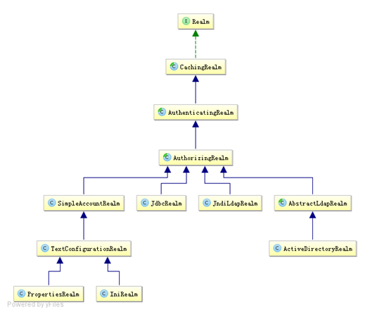

# 身份验证

## 登录代码

```java

    @Test
    public void testHelloworld() {
        //1. 获取SecurityManager工厂，此处使用Ini配置文件初始化SecurityManager
        Factory<org.apache.shiro.mgt.SecurityManager> factory =
                new IniSecurityManagerFactory("classpath:shiro.ini");
        //2. 得到SecurityManager实例 并绑定给SecurityUtils
        org.apache.shiro.mgt.SecurityManager securityManager = factory.getInstance();
        SecurityUtils.setSecurityManager(securityManager);
        //3. 得到Subject及创建用户名/密码身份验证Token（即用户身份/凭证）
        Subject subject = SecurityUtils.getSubject();
        UsernamePasswordToken token = new UsernamePasswordToken("zhang", "123");

        try {
            //4. 登录，即身份验证
            subject.login(token);
        } catch (AuthenticationException e) {
            //5. 身份验证失败
        }

        Assert.assertEquals(true, subject.isAuthenticated()); //断言用户已经登录

        //6. 退出
        subject.logout();
    }

```

1. 首先通过new IniSecurityManagerFactory并指定一个ini配置文件来创建一个SecurityManager工厂；

2. 接着获取SecurityManager并绑定到SecurityUtils，这是一个全局设置，设置一次即可；

3. 通过SecurityUtils得到Subject，其会自动绑定到当前线程；如果在web环境在请求结束时需要解除绑定；然后获取身份验证的Token，如用户名/密码；

4. 调用subject.login方法进行登录，其会自动委托给SecurityManager.login方法进行登录；

5. 如果身份验证失败请捕获AuthenticationException或其子类，常见的如： DisabledAccountException（禁用的帐号）. LockedAccountException（锁定的帐号）. UnknownAccountException（错误的帐号）. ExcessiveAttemptsException（登录失败次数过多）. IncorrectCredentialsException （错误的凭证）. ExpiredCredentialsException（过期的凭证）等，具体请查看其继承关系；对于页面的错误消息展示，最好使用如“用户名/密码错误”而不是“用户名错误”/“密码错误”，防止一些恶意用户非法扫描帐号库；

6. 最后可以调用subject.logout退出，其会自动委托给SecurityManager.logout方法退出。

## 身份认证流程


流程如下：

1. 首先调用Subject.login(token)进行登录，其会自动委托给Security Manager，调用之前必须通过SecurityUtils. setSecurityManager()设置；
2. SecurityManager负责真正的身份验证逻辑；它会委托给Authenticator进行身份验证；
3. Authenticator才是真正的身份验证者，Shiro API中核心的身份认证入口点，此处可以自定义插入自己的实现；
4. Authenticator可能会委托给相应的AuthenticationStrategy进行多Realm身份验证，默认ModularRealmAuthenticator会调用AuthenticationStrategy进行多Realm身份验证；
5. Authenticator会把相应的token传入Realm，从Realm获取身份验证信息，如果没有返回/抛出异常表示身份验证失败了。此处可以配置多个Realm，将按照相应的顺序及策略进行访问。

## 配置多Realm  shiro-realm.ini

```
#声明一个realm
myRealm1=com.github.zhangkaitao.shiro.chapter2.realm.MyRealm1
myRealm1=com.github.zhangkaitao.shiro.chapter2.realm.MyRealm2
#指定securityManager的realms实现
securityManager.realms=$myRealm1,$myRealm2
```

> securityManager会按照realms指定的顺序进行身份认证。此处我们使用显示指定顺序的方式指定了Realm的顺序，如果删除“securityManager.realms=$myRealm1,$myRealm2”，那么securityManager会按照realm声明的顺序进行使用（即无需设置realms属性，其会自动发现），当我们显示指定realm后，其他没有指定realm将被忽略，如“securityManager.realms=$myRealm1”，那么myRealm2不会被自动设置进去。

## shiro提供的Realm实现


以后一般继承AuthorizingRealm（授权）即可；其继承了AuthenticatingRealm（即身份验证），而且也间接继承了CachingRealm（带有缓存实现）。其中主要默认实现如下：

**org.apache.shiro.realm.text.IniRealm**：[users]部分指定用户名/密码及其角色；[roles]部分指定角色即权限信息；

**org.apache.shiro.realm.text.PropertiesRealm**： user.username=password,role1,role2指定用户名/密码及其角色；role.role1=permission1,permission2指定角色及权限信息；

**org.apache.shiro.realm.jdbc.JdbcRealm**：通过sql查询相应的信息，如“select password from users where username = ?”获取用户密码，“select password, password_salt from users where username = ?”获取用户密码及盐；“select role_name from user_roles where username = ?”获取用户角色；“select permission from roles_permissions where role_name = ?”获取角色对应的权限信息；也可以调用相应的api进行自定义sql

### JDBC Realm的使用

```

jdbcRealm=org.apache.shiro.realm.jdbc.JdbcRealm
dataSource=com.alibaba.druid.pool.DruidDataSource
dataSource.driverClassName=com.mysql.jdbc.Driver
dataSource.url=jdbc:mysql://localhost:3306/shiro
dataSource.username=root
#dataSource.password=123
jdbcRealm.dataSource=$dataSource
securityManager.realms=$jdbcRealm
```

1. 变量名=全限定类名会自动创建一个类实例

2. 变量名.属性=值 自动调用相应的setter方法进行赋值

3. $变量名 引用之前的一个对象实例


## Authenticator及AuthenticationStrategy : 验证和验证策略

SecurityManager接口继承了Authenticator，另外还有一个ModularRealmAuthenticator实现，其委托给多个Realm进行验证，验证规则通过AuthenticationStrategy接口指定，默认提供的实现：

    1. FirstSuccessfulStrategy：只要有一个Realm验证成功即可，只返回第一个Realm身份验证成功的认证信息，其他的忽略；
    2. AtLeastOneSuccessfulStrategy：只要有一个Realm验证成功即可，和FirstSuccessfulStrategy不同，返回所有Realm身份验证成功的认证信息；
    3. AllSuccessfulStrategy：所有Realm验证成功才算成功，且返回所有Realm身份验证成功的认证信息，如果有一个失败就失败了。

ModularRealmAuthenticator默认使用AtLeastOneSuccessfulStrategy策略。

